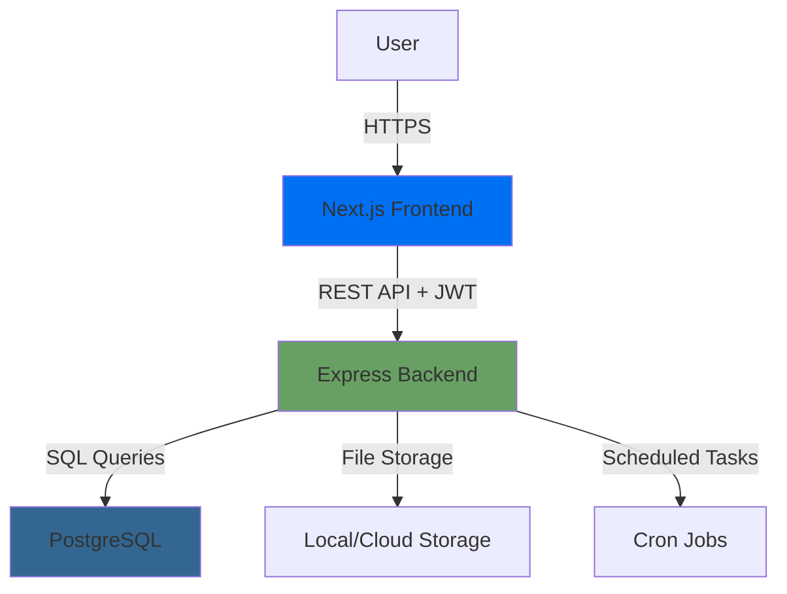
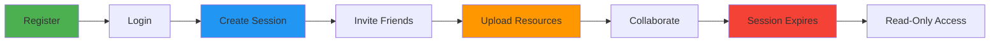

<div align="center">

# 🎓 CramRoom

### *Time-Bound Collaborative Exam Preparation Platform*

[](https://www.typescriptlang.org/)
[](https://nextjs.org/)
[](https://nodejs.org/)
[](https://www.postgresql.org/)
[](https://expressjs.com/)

**[Live Demo](#) • [Documentation](#) • [Report Bug](#) • [Request Feature](#)**

---

</div>

## 📋 Table of Contents

- [🌟 Overview](#-overview)
- [⚡ Problem Statement](#-problem-statement)
- [💡 Solution](#-solution)
- [✨ Key Features](#-key-features)
- [🏗️ Architecture](#️-architecture)
- [🛠️ Tech Stack](#️-tech-stack)
- [🚀 Getting Started](#-getting-started)
- [🎯 Usage](#-usage)
- [📸 Screenshots](#-screenshots)
- [🔮 Roadmap](#-roadmap)
- [👨‍💻 Author](#-author)

---

## 🌟 Overview

**CramRoom** is a backend-driven, time-bound collaborative exam preparation platform that transforms chaotic last-minute studying into a focused, disciplined experience. Built for students who need to maximize their exam preparation efficiency under time pressure.

> 💡 **Core Insight:** Exam preparation should have the same urgency and focus as the exam itself. CramRoom enforces time boundaries to eliminate procrastination and information overload.

<div align="center">

### 📊 Quick Stats

| 🎯 Sessions Created | 📁 Files Shared | ⏱️ Time Saved | 👥 Active Users |
|:-------------------:|:---------------:|:-------------:|:---------------:|
| Coming Soon | Coming Soon | Coming Soon | Coming Soon |

</div>

---

## ⚡ Problem Statement

### Traditional exam preparation is broken 💔

Students juggle multiple disconnected tools:

```
❌ WhatsApp → Coordination chaos
❌ Google Drive → Scattered files
❌ Random AI tools → Context switching
❌ No deadline enforcement → Endless procrastination
❌ Persistent clutter → Never-ending todo lists
```

### The Result?
**Distraction. Poor prioritization. Inefficient last-minute cramming.**

---

## 💡 Solution

<div align="center">

### CramRoom creates **focused, time-bound study environments**

</div>

```
✅ Single collaborative space per exam
✅ Automatic expiry after deadline
✅ Enforced discipline through time constraints
✅ Centralized resources and coordination
✅ Clean slate for every exam
```

---

## ✨ Key Features

<table>
<tr>
<td width="50%">

### 🔐 **Secure Authentication**
- JWT-based auth system
- Protected routes
- Role-based permissions
- Secure session management

</td>
<td width="50%">

### ⏱️ **Smart Session Lifecycle**
- Time-bound sessions
- Automatic expiry via cron jobs
- Read-only mode post-deadline
- Host vs participant roles

</td>
</tr>

<tr>
<td width="50%">

### 📂 **Seamless File Collaboration**
- Upload study materials
- Download shared resources
- Permission-based access
- Auto-lock after expiry

</td>
<td width="50%">

### 📊 **Insightful Dashboard**
- Active vs expired sessions
- Participation analytics
- Upload statistics
- Real-time updates

</td>
</tr>
</table>

---

## 🏗️ Architecture

<div align="center">



</div>

### 🎯 Design Principles

| Principle | Implementation |
|-----------|----------------|
| **Backend as Source of Truth** | All business logic server-side |
| **Time-Driven Architecture** | Cron-based session lifecycle |
| **Security First** | JWT auth, permission checks |
| **Scalable Design** | Clean separation of concerns |

---

## 🛠️ Tech Stack

<div align="center">

### Frontend


### Backend


</div>

---

## 🚀 Getting Started

### Prerequisites

Before you begin, ensure you have:

- **Node.js** (v18 or higher)
- **PostgreSQL** (v14 or higher)
- **npm** or **yarn**

### Installation

#### 1️⃣ Clone the Repository

```bash
git clone https://github.com/your-username/CramRoom.git
cd CramRoom
```

#### 2️⃣ Backend Setup

```bash
# Navigate to backend
cd backend

# Install dependencies
npm install

# Create .env file
cat > .env << EOF
PORT=5000
DB_HOST=localhost
DB_USER=your_db_user
DB_PASSWORD=your_db_password
DB_NAME=cramroom
DB_PORT=5432
JWT_SECRET=your_secret_key_here
EOF

# Run development server
npm run dev
```

#### 3️⃣ Frontend Setup

```bash
# Navigate to frontend (from project root)
cd frontend

# Install dependencies
npm install

# Create .env.local file
cat > .env.local << EOF
NEXT_PUBLIC_API_URL=http://localhost:5000
EOF

# Run development server
npm run dev
```

#### 4️⃣ Access the Application

Open your browser and navigate to:

```
http://localhost:3000
```

---

## 🎯 Usage

### 🎬 Demo Workflow



1. **Register & Login** → Create your account
2. **Create Session** → Set subject, exam date, and deadline
3. **Join Session** → Share session code with study partners
4. **Upload Resources** → Add notes, PDFs, and study materials
5. **Collaborate** → Everyone contributes before deadline
6. **Automatic Expiry** → Session locks after exam time
7. **Archive Access** → View past sessions in read-only mode

---

## 📸 Screenshots

<div align="center">

### Dashboard

*Clean, intuitive dashboard showing active and expired sessions*

### Session View

*Collaborative workspace with file uploads and participant list*

### Authentication

*Secure login and registration interface*

</div>

---

## 🔮 Roadmap

- [x] Core session management
- [x] File upload/download
- [x] JWT authentication
- [x] Automatic session expiry
- [x] Dashboard analytics
- [ ] 🤖 AI-powered study strategy generator
- [ ] 💬 Real-time chat within sessions
- [ ] 📱 Mobile app (React Native)
- [ ] 🎨 Custom themes
- [ ] 📊 Advanced analytics dashboard
- [ ] 🌐 Deployment with live demo
- [ ] 🔔 Push notifications for deadlines
- [ ] 🎯 Gamification (study streaks, badges)

---

## 🤝 Contributing

Contributions are what make the open-source community amazing! Any contributions you make are **greatly appreciated**.

1. Fork the Project
2. Create your Feature Branch (`git checkout -b feature/AmazingFeature`)
3. Commit your Changes (`git commit -m 'Add some AmazingFeature'`)
4. Push to the Branch (`git push origin feature/AmazingFeature`)
5. Open a Pull Request

---

## 📝 License

Distributed under the MIT License. See `LICENSE` for more information.

---

## 👨‍💻 Author

<div align="center">

### **Nitin Rawat**

**B.Tech CSE Student**

*Passionate about backend engineering, system design, and building solutions for real-world problems*

[](#)
[](#)
[](#)
[](#)

</div>

---

## 🎯 One-Liner

> **CramRoom enforces focus, structure, and discipline in exam preparation through time-bound collaborative sessions with backend-driven lifecycle management.**

---

## 💬 Why This Project Stands Out

<div align="center">

| Aspect | Details |
|--------|---------|
| 🎨 **Not Another CRUD** | Time-aware system with automatic lifecycle |
| ⚙️ **Backend-Heavy Logic** | Complex business rules enforced server-side |
| 🌍 **Real-World Problem** | Solves actual student pain points |
| 📚 **Scalable Architecture** | Clean code, proper separation of concerns |
| 🔧 **Production-Ready** | JWT auth, cron jobs, proper error handling |

</div>

---

<div align="center">

### 🌟 If you find this project useful, please consider giving it a star!

**Made with ❤️ and ☕ by Nitin Rawat**

</div>

---

## 📚 Additional Resources

- [Project Documentation](#)
- [API Reference](#)
- [System Design Decisions](#)
- [Performance Benchmarks](#)

---

## 🐛 Known Issues

Check the [Issues](../../issues) page for known bugs and feature requests.

---

## 🙏 Acknowledgments

- Built as a learning project to understand full-stack development
- Inspired by real exam preparation struggles
- Thanks to the open-source community for amazing tools

---

<div align="center">

**[⬆ Back to Top](#-cramroom)**

</div>