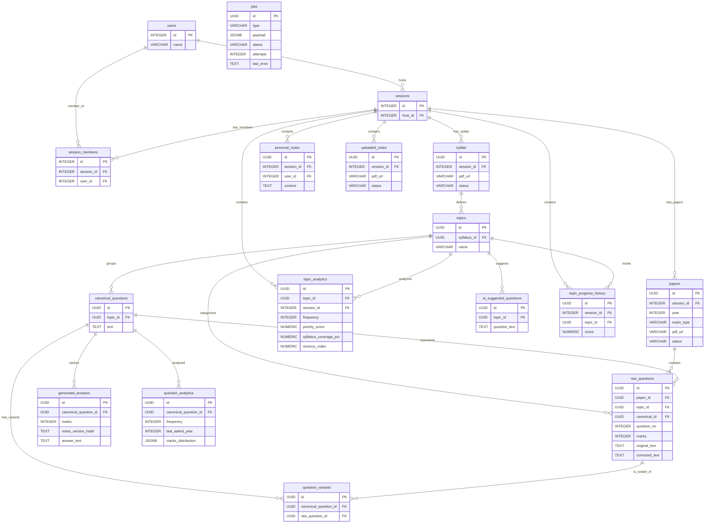
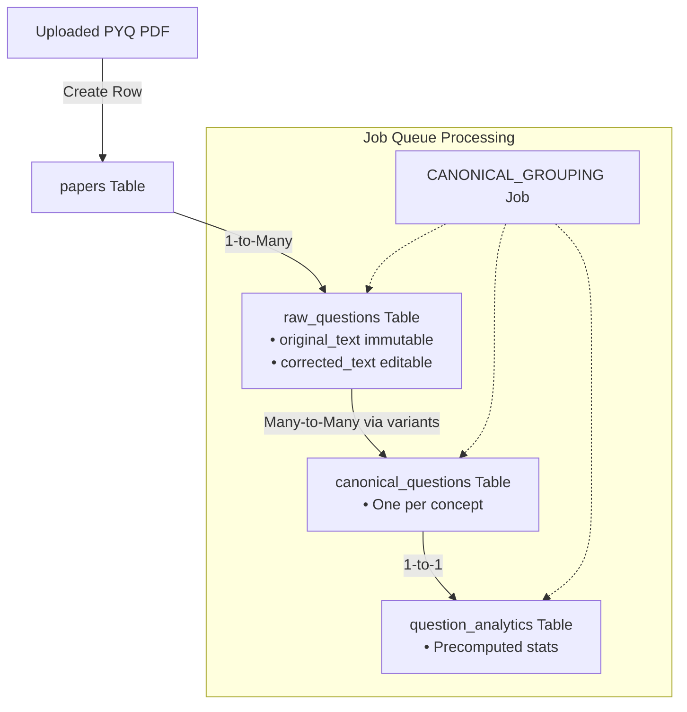
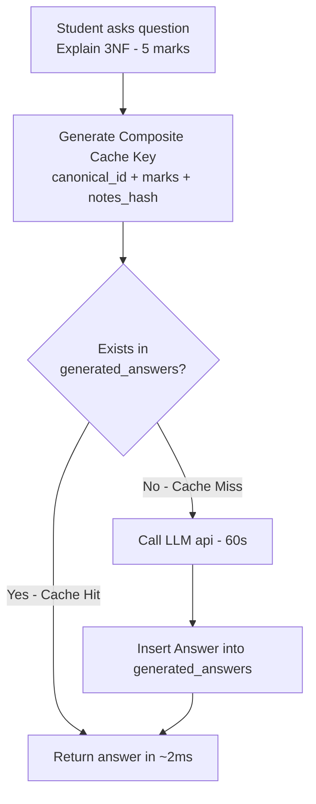
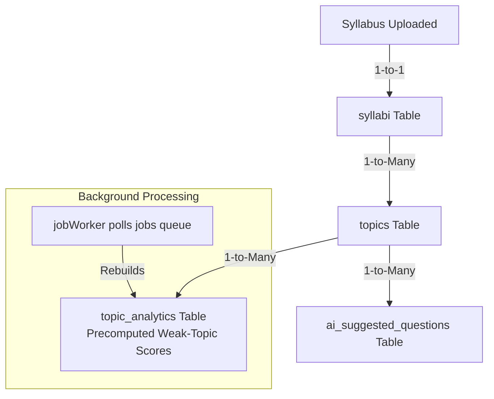
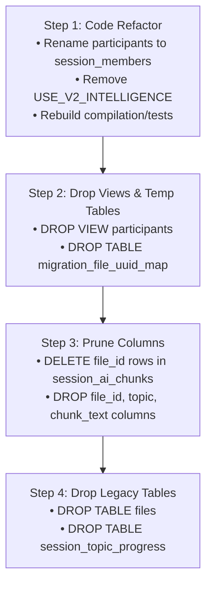
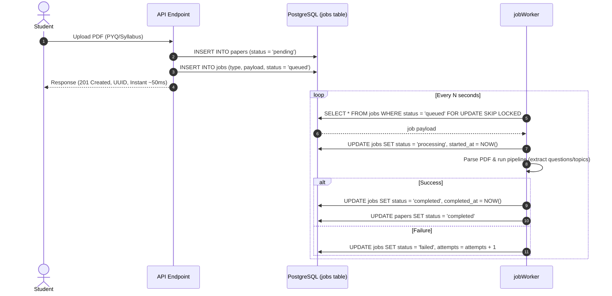
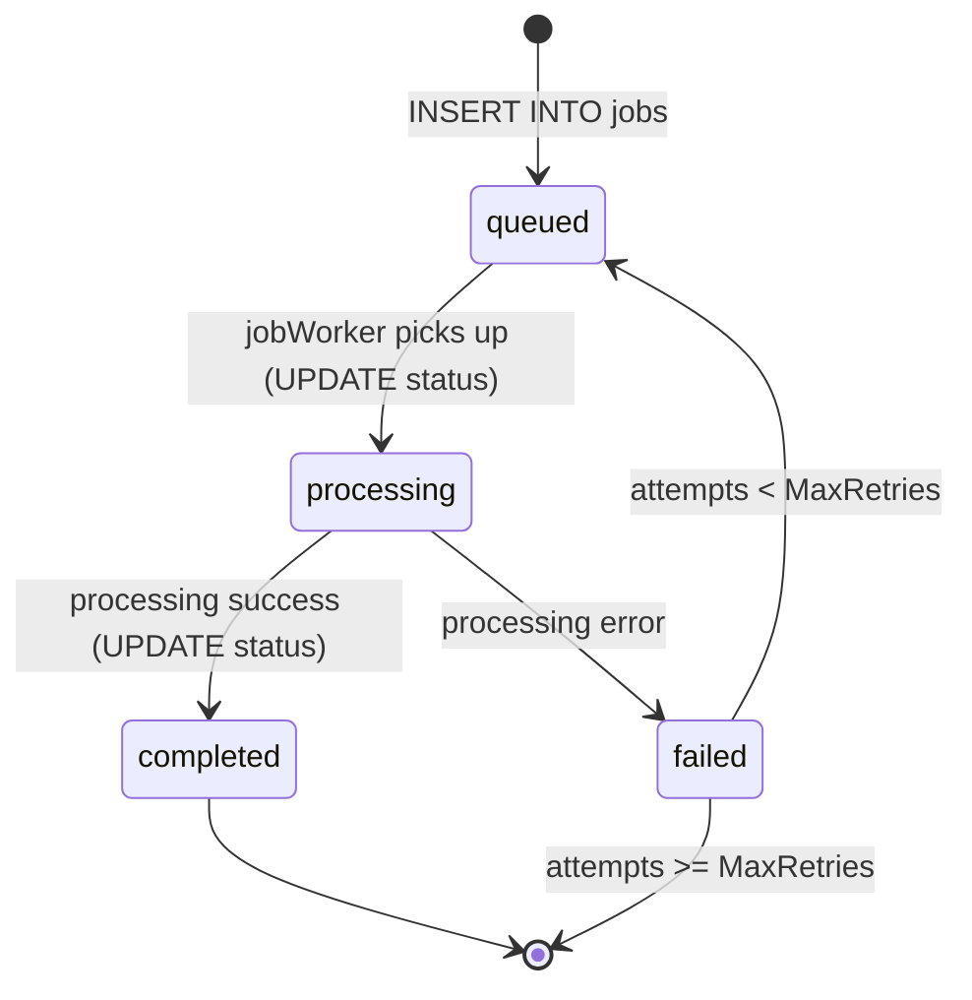

# PHASE 1: DATABASE COMPLETION — Final Reference Document

> **Purpose:** This document is a single-source revision guide for the Database Phase of CramRoom. It consolidates all sub-phase reports (Schema, Data, Service, Testing, Legacy Cleanup) into one readable narrative. Use it for **interview preparation** and **future onboarding**.
>
> **Audience:** Returning engineer who needs to recall *what was done, why, how, and what's next* without re-reading ten reports.
>
> **Reading time:** ~30 minutes for full retention.

---

## TABLE OF CONTENTS

1. [Big Picture & Design Philosophy](#1-big-picture--design-philosophy)
2. [V1 vs V2 — Why We Migrated](#2-v1-vs-v2--why-we-migrated)
3. [Phase Execution Timeline](#3-phase-execution-timeline)
4. [V2 Schema — Final State](#4-v2-schema--final-state)
5. [Entity Relationship Diagrams & Data Flows](#5-entity-relationship-diagrams--data-flows)
6. [Migration Strategy — Code-First, Database-Last](#6-migration-strategy--code-first-database-last)
7. [Service Layer Changes](#7-service-layer-changes)
8. [Background Job Architecture](#8-background-job-architecture)
9. [Rollback Strategy](#9-rollback-strategy)
10. [Testing Strategy & Results](#10-testing-strategy--results)
11. [Legacy Cleanup — What Was Removed](#11-legacy-cleanup--what-was-removed)
12. [Interview Talking Points](#12-interview-talking-points)
13. [Known Technical Debt](#13-known-technical-debt)
14. [What's Next — Topic System Phase](#14-whats-next--topic-system-phase)
15. [Glossary](#15-glossary)

---

## 1. BIG PICTURE & DESIGN PHILOSOPHY

### The Core Mantra

> **"Evidence First, AI Second."**

Every piece of extracted data (PDF question text, syllabus topics, exam metadata) is stored as **immutable ground truth** in the database. The AI layer is then an *enhancement* that derives predictions, groups similar questions, and generates answers from that structured evidence.

### Why This Matters in an Interview

The interviewer is testing whether you understand the difference between:
- **Heuristic AI** (rules, regex, in-memory TF-IDF) — fast to ship, brittle at scale.
- **Evidence-driven AI** (cached analytics, canonical groupings, precomputed stats) — slower to design but predictable, indexable, and auditable.

CramRoom V2 chose the second.

### High-Level System Flow

#### Visual Flowchart (Mermaid)
```mermaid
graph TD
    A[Student Uploads PDF <br> PYQ paper / Syllabus / Notes] --> B[Step 1: Validate + Classify <br> Multer &rarr; Buffer in memory]
    B --> C[Step 2: Write Parent Metadata <br> papers | syllabi | uploaded_notes <br> Returns UUID, enqueues async job]
    C --> D[Step 3: Background Worker <br> async, polled <br> Parse text &rarr; raw_questions, topics, canonicals <br> Rebuild analytics]
    D --> E[Step 4: Student Asks Question <br> V2 AI Engine reads V2 tables <br> Cache hit/miss answer generation]
```

#### Text Flowchart (ASCII)
```
┌─────────────────────────────────────────────────────────────────┐
│                     STUDENT UPLOADS PDF                         │
│                  (PYQ paper / Syllabus / Notes)                 │
└─────────────────────────────┬───────────────────────────────────┘
                              │
                              ▼
┌─────────────────────────────────────────────────────────────────┐
│                  STEP 1: VALIDATE + CLASSIFY                     │
│         (Session active? Participant? PDF or DOCX?)              │
│                  Multer → Buffer in memory                       │
└─────────────────────────────┬───────────────────────────────────┘
                              │
                              ▼
┌─────────────────────────────────────────────────────────────────┐
│              STEP 2: WRITE PARENT METADATA (sync)               │
│     papers  |  syllabi  |  uploaded_notes                       │
│     Returns UUID; enqueues async job                            │
└─────────────────────────────┬───────────────────────────────────┘
                              │
                              ▼
┌─────────────────────────────────────────────────────────────────┐
│           STEP 3: BACKGROUND WORKER (async, polled)             │
│   • Parse text   • Extract questions / topics                    │
│   • Insert: raw_questions / topics / canonical_questions        │
│   • Rebuild analytics: topic_analytics / question_analytics     │
└─────────────────────────────┬───────────────────────────────────┘
                              │
                              ▼
┌─────────────────────────────────────────────────────────────────┐
│            STEP 4: STUDENT ASKS QUESTION (V2 Path)               │
│   • AI Engine reads: raw_questions + topics + uploaded_notes    │
│   • Generates answer OR fetches from generated_answers cache    │
│   • Saves to session_ai_messages (audit log)                    │
└─────────────────────────────────────────────────────────────────┘
```

---

## 2. V1 vs V2 — WHY WE MIGRATED

### V1 Pain Points (the "Why")

| Pain Point | V1 Behavior | Why It Was Bad |
|------------|-------------|----------------|
| **Single overloaded `files` table** | Stored PYQs, syllabi, notes all together | No way to differentiate query patterns; FKs tangled |
| **Single overloaded `session_ai_chunks`** | Mixed document chunks + chat summaries + PYQ rows | Filter logic (`WHERE file_id IS NOT NULL`) was fragile |
| **Mutable raw text** | Corrections overwrote PDF-extracted text | Lost the original verbatim evidence |
| **No canonical grouping** | "Explain 3NF" and "What is Third Normal Form?" treated as different | Analytics double-counted; recency stats wrong |
| **On-the-fly heuristics** | Topic weakness computed at query time using regex word-counting | Slow dashboards; non-indexable |
| **No answer cache** | Every identical question hit the LLM | Wasted $$ and latency |
| **`USE_V2_INTELLIGENCE` feature flag** | Code branched on V1 vs V2 at runtime | Dead-code complexity, hard to reason about |

### V2 Wins (the "What")

| V2 Capability | Concrete Benefit |
|---------------|------------------|
| **Segregated tables** (`papers`, `syllabi`, `uploaded_notes`) | Targeted indexes per content type |
| **`raw_questions.original_text` (immutable) + `corrected_text` (editable)** | Audit trail preserved |
| **`canonical_questions` + `question_variants`** | "Same concept" recognized across rephrasings |
| **`topic_analytics` / `question_analytics` precomputed** | Dashboard queries in <30ms |
| **`generated_answers` cache** keyed by `(canonical_question_id, marks, notes_hash)` | Identical question = 2ms cache hit vs 60s LLM call |
| **Background `jobs` queue** | Upload API returns instantly; processing happens async |
| **No feature flag** | Single V2 code path; dead branches removed |

### Side-by-Side Table Count

| Version | Tables | Notes |
|---------|--------|-------|
| **V1** | 9 (overloaded) | `files`, `session_ai_chunks`, `session_topic_progress`, etc. |
| **V2** | 17 (specialized) | 14 specialized tables + 3 legacy compatibility tables |

---

## 3. PHASE EXECUTION TIMELINE

The Database Phase was executed in **six sub-phases**, each with its own plan, execution, and review document.

#### Visual Timeline (Mermaid)
```mermaid
flowchart TD
    subgraph Phase 1A [Phase 1A: Schema Design & Gap Analysis]
        A1[DATABASE_CURRENT_STATE.md]
        A2[DATABASE_GAP_ANALYSIS.md]
        A3[DATABASE_V2_DESIGN.md]
    end
    subgraph Phase 1B [Phase 1B: Schema Migration]
        B1[migration_v2_schema.sql]
        B2[DATA_MIGRATION_PLAN.md]
    end
    subgraph Phase 1C [Phase 1C: Data Migration]
        C1[runDataMigration.ts]
        C2[runValidation.ts]
        C3[DATABASE_MIGRATION_REVIEW.md]
    end
    subgraph Phase 1D [Phase 1D: Service Migration]
        D1[SERVICE_MIGRATION_PLAN.md]
        D2[Service Code Refactor]
    end
    subgraph Phase 1E [Phase 1E: Testing]
        E1[DATABASE_TESTING_PLAN.md]
        E2[runDatabaseTests.ts]
        E3[DATABASE_TESTING_REVIEW.md]
    end
    subgraph Phase 1F [Phase 1F: Legacy Cleanup]
        F1[LEGACY_CLEANUP_PLAN.md]
        F2[migration_v2_cleanup.sql]
        F3[runCleanup.ts]
        F4[LEGACY_CLEANUP_REVIEW.md]
    end
    Phase 1A --> Phase 1B --> Phase 1C --> Phase 1D --> Phase 1E --> Phase 1F
```

#### Text Timeline (ASCII)
```
┌──────────────────────────────────────────────────────────────────┐
│ PHASE 1A: SCHEMA DESIGN & GAP ANALYSIS                          │
│  ├─ DATABASE_CURRENT_STATE.md     (audit V1)                    │
│  ├─ DATABASE_GAP_ANALYSIS.md      (KEEP/MODIFY/REMOVE/NEW)       │
│  └─ DATABASE_V2_DESIGN.md         (final 14-table spec)         │
├──────────────────────────────────────────────────────────────────┤
│ PHASE 1B: SCHEMA MIGRATION (DDL only)                           │
│  ├─ DATA_MIGRATION_PLAN.md         (per-table strategy)          │
│  └─ DATABASE_MIGRATION_EXECUTION_PLAN.md                        │
│      • migration_v2_schema.sql     (13 new tables created)      │
│      • migration_v2_data_patch.sql  (idempotency columns)       │
├──────────────────────────────────────────────────────────────────┤
│ PHASE 1C: DATA MIGRATION                                         │
│  └─ DATABASE_MIGRATION_REVIEW.md   (Step 2 review, P0/P1 fixes) │
│      • runDataMigration.ts         (7-phase additive copy)      │
│      • runValidation.ts            (count + FK integrity)       │
├──────────────────────────────────────────────────────────────────┤
│ PHASE 1D: SERVICE MIGRATION (code refactor)                     │
│  └─ SERVICE_MIGRATION_PLAN.md                                    │
│      • Dual-write / dual-read transition phase                   │
│      • 8 service files updated                                   │
│      • V2 feature flag flipped ON                                │
├──────────────────────────────────────────────────────────────────┤
│ PHASE 1E: TESTING                                                │
│  ├─ DATABASE_TESTING_PLAN.md       (7-section test plan)         │
│  └─ DATABASE_TESTING_REVIEW.md     (56/56 PASS)                  │
│      • runDatabaseTests.ts         (full integration suite)      │
│      • test_v2_services.ts         (service unit tests)          │
├──────────────────────────────────────────────────────────────────┤
│ PHASE 1F: LEGACY CLEANUP                                         │
│  ├─ LEGACY_CLEANUP_PLAN.md         (inventory + safety checks)   │
│  └─ LEGACY_CLEANUP_REVIEW.md       (8 artifacts verified)       │
│      • migration_v2_cleanup.sql    (DROP legacy, CREATE V2)      │
│      • runCleanup.ts               (orchestrator)                │
└──────────────────────────────────────────────────────────────────┘
```

### Commit Timeline

```
018ced3  test(db): add comprehensive database testing suite
0e6bbf3  feat(backend): migrate backend services to V2 database tables
58173c0  feat(db-migration): implement V2 data migration and resolve P0/P1
f2c70b4  feat(db): implement database schema V2 (Step 1)
```

---

## 4. V2 SCHEMA — FINAL STATE

### The 17 Tables

| # | Table | Type | Purpose | PK Type |
|---|-------|------|---------|---------|
| 1 | `users` | **Existing** | Auth + profile | INTEGER |
| 2 | `sessions` | **Existing** | Workspace container | INTEGER |
| 3 | `session_members` | **Existing** | Membership join (was `participants`) | INTEGER |
| 4 | `papers` | **New (V2)** | PYQ paper metadata | UUID |
| 5 | `syllabi` | **New (V2)** | Syllabus text + metadata | UUID |
| 6 | `topics` | **New (V2)** | Syllabus topics | UUID |
| 7 | `raw_questions` | **New (V2)** | Verbatim PDF question text | UUID |
| 8 | `canonical_questions` | **New (V2)** | Question concept groupings | UUID |
| 9 | `question_variants` | **New (V2)** | canonical ↔ raw join | UUID |
| 10 | `generated_answers` | **New (V2)** | AI answer cache | UUID |
| 11 | `personal_notes` | **New (V2)** | Student-typed study notes | UUID |
| 12 | `uploaded_notes` | **New (V2)** | Uploaded class notes/slides | UUID |
| 13 | `topic_analytics` | **New (V2)** | Precomputed topic stats | UUID |
| 14 | `question_analytics` | **New (V2)** | Precomputed question stats | UUID |
| 15 | `ai_suggested_questions` | **New (V2)** | AI recommendations cache | UUID |
| 16 | `jobs` | **New (V2)** | Background worker queue | UUID |
| 17 | `topic_progress_history` | **New (V2)** | Replaces session_topic_progress | UUID |

> **Note:** V2 keeps three legacy tables (`users`, `sessions`, `session_members`) with **integer** primary keys. All new tables use **UUIDs**. This preserves backward compatibility with the chat and session systems that still reference integer IDs.

### The "Evidence First" Tables — Deep Dive

These four tables are the heart of the V2 philosophy:

#### `papers`
```sql
CREATE TABLE papers (
    id          UUID PRIMARY KEY DEFAULT gen_random_uuid(),
    session_id  INTEGER NOT NULL REFERENCES sessions(id) ON DELETE CASCADE,
    year        INTEGER,
    exam_type   VARCHAR(50),
    pdf_url     VARCHAR(500),
    status      VARCHAR(50) DEFAULT 'pending',  -- pending|processing|completed|failed
    created_at  TIMESTAMP DEFAULT NOW()
);
```
- **One row per uploaded PYQ PDF.**
- `status` reflects the async job state (linked to `jobs` queue).

#### `raw_questions`
```sql
CREATE TABLE raw_questions (
    id            UUID PRIMARY KEY DEFAULT gen_random_uuid(),
    paper_id      UUID NOT NULL REFERENCES papers(id) ON DELETE CASCADE,
    topic_id      UUID REFERENCES topics(id),
    canonical_id  UUID REFERENCES canonical_questions(id),
    question_no   INTEGER,
    marks         INTEGER,
    original_text TEXT NOT NULL,        -- IMMUTABLE (PDF-extracted)
    corrected_text TEXT,                -- EDITABLE (admin-fixed)
    created_at    TIMESTAMP DEFAULT NOW(),
    migrated_from_chunk_id TEXT         -- for idempotent re-runs
);
```
- **`original_text` is the immutable ground truth.**
- **`corrected_text` is the editable layer** for typo fixes.
- `migrated_from_chunk_id` ensures the migration script can re-run safely.

#### `canonical_questions`
```sql
CREATE TABLE canonical_questions (
    id          UUID PRIMARY KEY DEFAULT gen_random_uuid(),
    topic_id    UUID NOT NULL REFERENCES topics(id) ON DELETE CASCADE,
    text        TEXT NOT NULL,
    created_at  TIMESTAMP DEFAULT NOW()
);
```
- **One row per unique question concept.**
- "Explain 3NF" and "What is Third Normal Form?" both link here.

#### `question_variants`
```sql
CREATE TABLE question_variants (
    id                   UUID PRIMARY KEY DEFAULT gen_random_uuid(),
    canonical_question_id UUID NOT NULL REFERENCES canonical_questions(id) ON DELETE CASCADE,
    raw_question_id       UUID NOT NULL REFERENCES raw_questions(id) ON DELETE CASCADE,
    UNIQUE(canonical_question_id, raw_question_id)
);
```
- **Many-to-many join** between canonical concepts and raw variants.

### The Caching Tables

#### `generated_answers`
```sql
CREATE TABLE generated_answers (
    id                      UUID PRIMARY KEY DEFAULT gen_random_uuid(),
    canonical_question_id   UUID NOT NULL REFERENCES canonical_questions(id) ON DELETE CASCADE,
    marks                   INTEGER NOT NULL,
    notes_version_hash      TEXT NOT NULL,
    answer_text             TEXT NOT NULL,
    created_at              TIMESTAMP DEFAULT NOW(),
    UNIQUE(canonical_question_id, marks, notes_version_hash)
);
```
- **The unique constraint is the cache key.**
- If a student edits their notes, `notes_version_hash` changes → new cache row → old answer invalidated automatically.

### The Analytics Tables

#### `topic_analytics`
```sql
CREATE TABLE topic_analytics (
    id                      UUID PRIMARY KEY DEFAULT gen_random_uuid(),
    topic_id                UUID NOT NULL REFERENCES topics(id) ON DELETE CASCADE,
    session_id              INTEGER NOT NULL REFERENCES sessions(id) ON DELETE CASCADE,
    frequency               INTEGER NOT NULL,
    priority_score          NUMERIC,
    syllabus_coverage_pct   NUMERIC,
    recency_index           NUMERIC,
    updated_at              TIMESTAMP DEFAULT NOW()
);
```

#### `question_analytics`
```sql
CREATE TABLE question_analytics (
    id                      UUID PRIMARY KEY DEFAULT gen_random_uuid(),
    canonical_question_id   UUID NOT NULL REFERENCES canonical_questions(id) ON DELETE CASCADE,
    frequency               INTEGER NOT NULL,
    last_asked_year         INTEGER,
    marks_distribution      JSONB,    -- e.g. {"5": 3, "10": 1}
    updated_at              TIMESTAMP DEFAULT NOW()
);
```

### The Queue Table

#### `jobs`
```sql
CREATE TABLE jobs (
    id              UUID PRIMARY KEY DEFAULT gen_random_uuid(),
    type            VARCHAR(50) NOT NULL,  -- UPLOAD_PROCESSING|SYLLABUS_PROCESSING|...
    payload         JSONB NOT NULL,
    status          VARCHAR(50) DEFAULT 'queued',  -- queued|processing|completed|failed
    attempts        INTEGER DEFAULT 0,
    last_error      TEXT,
    created_at      TIMESTAMP DEFAULT NOW(),
    started_at      TIMESTAMP,
    completed_at    TIMESTAMP
);
```
- **Job types:** `UPLOAD_PROCESSING`, `SYLLABUS_PROCESSING`, `TOPIC_MAPPING`, `CANONICAL_GROUPING`, `ANALYTICS_REBUILD`, `ANSWER_GENERATION`, `AI_SUGGESTED_GENERATION`.

---

## 5. ENTITY RELATIONSHIP DIAGRAMS & DATA FLOWS

### 5.1 The Full V2 ERD

#### Visual Flowchart (Mermaid)


#### Text Flowchart (ASCII)
```
                      ┌───────────────┐
                      │     users     │  (INTEGER PK)
                      └───────┬───────┘
                              │
                  ┌───────────┴───────────┐
                  │ host_id               │ uploaded_by
                  ▼                       ▼
            ┌───────────┐         ┌───────────────┐
            │ sessions  │         │ personal_notes│
            │ (INT PK)  │         │ (UUID PK)     │
            └─────┬─────┘         └───────────────┘
                  │
       ┌──────────┼──────────┬──────────────┬──────────────┐
       │          │          │              │              │
       ▼          ▼          ▼              ▼              ▼
  ┌─────────┐ ┌─────────┐ ┌──────────┐ ┌─────────┐ ┌──────────┐
  │ session_│ │ papers  │ │ syllabi  │ │ upload_ │ │   jobs   │
  │ members │ │ (UUID)  │ │ (UUID)   │ │ notes   │ │ (UUID)   │
  │ (INT)   │ └────┬────┘ └────┬─────┘ │ (UUID)  │ │          │
  └─────────┘      │           │       └─────────┘ └──────────┘
                   │ 1         │ 1
                   ▼ *         ▼ *
              ┌──────────┐  ┌─────────┐
              │raw_      │  │ topics  │
              │questions │◄─┤ (UUID)  │
              │(UUID)    │  └────┬────┘
              └────┬─────┘       │ 1
                   │ *           │
                   ▼             ▼ *
              ┌──────────────────────┐
              │ canonical_questions  │
              │        (UUID)        │
              └────┬─────────────┬───┘
                   │ 1           │ 1
                   ▼ *           ▼ *
         ┌─────────────────┐ ┌──────────────────┐
         │question_variants│ │ generated_       │
         │     (UUID)      │ │ answers (cache)  │
         └─────────────────┘ └──────────────────┘

  ┌─────────────────┐   ┌──────────────────┐
  │ topic_analytics │   │question_analytics│
  │     (UUID)      │   │     (UUID)       │
  └─────────────────┘   └──────────────────┘
           ▲                     ▲
           └──────────┬──────────┘
                      │
                      │ (rebuilt by jobWorker)
                      │
                  [jobs queue]
```

### 5.2 The "Question Lifecycle" Zoom-In

#### Visual Flowchart (Mermaid)


#### Text Flowchart (ASCII)
```
   Uploaded PDF
        │
        ▼
   ┌─────────┐         ┌──────────────────┐
   │ papers  │ 1────*  │   raw_questions  │
   └─────────┘         │  • original_text │
        │              │  • corrected_text│
        │              │  • marks, year   │
        └────────┬─────────┘
                 │ *
                 ▼ 1
        ┌──────────────────────┐
        │ canonical_questions  │
        │  (one per concept)   │
        └────────┬─────────────┘
                 │ 1
                 ▼ *
        ┌──────────────────────┐
        │  question_variants   │
        │  (canonical ↔ raw)   │
        └──────────────────────┘
        │
        ▼
   [jobs queue: CANONICAL_GROUPING]
        │
        ▼
   ┌──────────────────┐
   │question_analytics│  ← precomputed (frequency, recency, marks)
   └──────────────────┘
```

### 5.3 The Answer Cache Flow

#### Visual Flowchart (Mermaid)


#### Text Flowchart (ASCII)
```
   Student asks: "Explain 3NF (5 marks)"
        │
        ▼
   ┌──────────────────────────────────────────┐
   │ Hash: canonical_id + marks + notes_hash  │
   └─────────────────┬────────────────────────┘
                     │
                     ▼
         ┌──── exists in generated_answers? ────┐
         │                                       │
        YES                                     NO
         │                                       │
         ▼                                       ▼
   ┌─────────────┐                     ┌─────────────────────┐
   │ Cache HIT   │                     │ Call LLM (60s)      │
   │ Return ~2ms │                     │ Insert into cache    │
   └─────────────┘                     │ Return answer       │
                                       └─────────────────────┘
```

### 5.4 The Topic System Flow

#### Visual Flowchart (Mermaid)


#### Text Flowchart (ASCII)
```
   Syllabus uploaded
        │
        ▼
   ┌─────────┐
   │ syllabi │
   └────┬────┘
        │ 1
        ▼ *
   ┌─────────┐    1     ┌──────────────────┐
   │ topics  │─────────►│ ai_suggested_    │
   └────┬────┘    *     │   questions      │
        │ 1             └──────────────────┘
        ▼ *
   ┌──────────────────┐
   │ topic_analytics  │  ← precomputed weak-topic scores
   └──────────────────┘
        ▲
        │ (rebuilt by ANALYTICS_REBUILD job)
        │
   [jobWorker polls jobs queue]
```

---

## 6. MIGRATION STRATEGY — CODE-FIRST, DATABASE-LAST

### The Golden Rule

> **Never drop a legacy table until every line of code that referenced it has been refactored.**

The reverse is the most common migration failure mode: drop the table, app crashes in production, panic rollback.

### The 4-Step Cleanup Sequence

#### Visual Flowchart (Mermaid)


#### Text Flowchart (ASCII)
```
   ┌───────────────────────────────────────────────┐
   │ STEP 1: CODE REFACTOR (before any DB drops)   │
   │  • Rename `participants` → `session_members`  │
   │  • Remove USE_V2_INTELLIGENCE branches         │
   │  • Remove migration_file_uuid_map joins        │
   │  • Migrate topic progress to UUID-based        │
   │  • Deploy + monitor under feature flag         │
   └─────────────────────┬─────────────────────────┘
                         │ (compile + integration tests pass)
                         ▼
   ┌───────────────────────────────────────────────┐
   │ STEP 2: DROP VIEWS + TEMP TABLES               │
   │  • DROP VIEW participants                      │
   │  • DROP TABLE migration_file_uuid_map         │
   └─────────────────────┬─────────────────────────┘
                         │ (validate service health)
                         ▼
   ┌───────────────────────────────────────────────┐
   │ STEP 3: PRUNE COLUMNS FROM ACTIVE TABLES      │
   │  • DELETE rows where file_id IS NOT NULL       │
   │    in session_ai_chunks                        │
   │  • DROP COLUMNS file_id, topic, chunk_text     │
   └─────────────────────┬─────────────────────────┘
                         │ (validate chat summaries still write)
                         ▼
   ┌───────────────────────────────────────────────┐
   │ STEP 4: DROP LEGACY TABLES                    │
   │  • DROP TABLE files                            │
   │  • DROP TABLE session_topic_progress           │
   └───────────────────────────────────────────────┘
```

### Why This Order Matters

| Step Reversed | Failure Mode |
|---------------|--------------|
| Drop table first | Code still queries `files` &rarr; 500 errors |
| Drop view before renaming | Room creation crashes mid-flight |
| Prune columns before testing chat | Chat summarizer breaks silently |

---

## 7. SERVICE LAYER CHANGES

### 8 Service Files Refactored

| File | V1 Behavior | V2 Behavior |
|------|-------------|-------------|
| `knowledgeUpload.service.ts` | Sync chunking &rarr; write to `files` + `session_ai_chunks` | Write parent metadata &rarr; enqueue job |
| `pyqRecommendation.service.ts` | Substring matching against `session_ai_chunks` | JOIN `canonical_questions` + `question_analytics` |
| `weakTopicAnalytics.service.ts` | Word-count heuristic at query time | Read precomputed `topic_analytics` |
| `topicProgress.service.ts` | Snapshot diff in `session_topic_progress` | Snapshot diff in `topic_progress_history` |
| `aiEngine.service.ts` | 5 intents, 3 of which branched on flag | 5 intents, single V2 path |
| `sessionContext.service.ts` | JOIN `migration_file_uuid_map` for legacy IDs | Use native UUIDs directly |
| `knowledgeChunk.model.ts` | `WHERE file_id IS NOT NULL` chunk retrieval | UNION ALL across `raw_questions + topics + uploaded_notes` |
| `sessionAiChunk.model.ts` | Dual-purpose with file_id filter | Chat-summary only (V1 columns dropped) |

### Key Refactor Pattern: Dual-Write &rarr; Single-Write

#### Visual Flowchart (Mermaid)
```mermaid
flowchart TD
    subgraph V1 Transition (Dual-Write)
        U1[Upload PDF] --> W1[INSERT INTO files]
        U1 --> W2[INSERT INTO session_ai_chunks]
        U1 --> W3[INSERT INTO migration_file_uuid_map]
    end
    subgraph V2 Final (Single-Write Async)
        U2[Upload PDF] --> WA[INSERT INTO papers]
        U2 --> WB[INSERT INTO jobs queue]
        WB -.->|jobWorker picks up async| JobProc[Process Job<br>• Parse text<br>• INSERT raw_questions<br>• UPDATE canonicals & analytics]
    end
```

#### Text Flowchart (ASCII)
```
   BEFORE (Dual-Write — V1 transitional):
   ┌─────────────────────────────────────┐
   │ Upload PDF                          │
   │   ├─ INSERT INTO files (legacy)     │
   │   ├─ INSERT INTO session_ai_chunks  │
   │   └─ INSERT INTO migration_file_    │
   │      uuid_map (legacy → V2)         │
   └─────────────────────────────────────┘
                │
                ▼
   AFTER (Single-Write + Async — V2 final):
   ┌─────────────────────────────────────┐
   │ Upload PDF                          │
   │   ├─ INSERT INTO papers (UUID)      │
   │   └─ INSERT INTO jobs (queue)       │
   └─────────────────────────────────────┘
                │
                ▼ (jobWorker picks up async)
   ┌─────────────────────────────────────┐
   │ Process Job                         │
   │   ├─ Parse text                     │
   │   ├─ INSERT INTO raw_questions      │
   │   ├─ INSERT/UPDATE canonical_       │
   │   │   questions                     │
   │   └─ INSERT/UPDATE question_        │
   │       analytics                     │
   └─────────────────────────────────────┘
```

---

## 8. BACKGROUND JOB ARCHITECTURE

### Why Async?

The V1 upload endpoint did **synchronous PDF parsing and chunking on the request thread**. A 10MB PYQ PDF could block the API for 30+ seconds. V2 made ingestion asynchronous:

#### Visual Flowchart (Mermaid Sequence Diagram)


#### Text Flowchart (ASCII)
```
   ┌──────────────────┐                ┌──────────────────┐
   │  API Endpoint    │                │  jobWorker       │
   │  (fast, ~50ms)   │                │  (polls every Xs)│
   └────────┬─────────┘                └────────▲─────────┘
            │                                   │
            │ INSERT INTO jobs                  │ SELECT *
            │ (status='queued')                 │ WHERE status='queued'
            │                                   │
            ▼                                   │
       ┌──────────────────────────────────────────┐
       │              jobs table                  │
       │  (UUID, type, payload JSONB, status)     │
       └──────────────────────────────────────────┘
```

### Job Lifecycle State Machine

#### Visual Flowchart (Mermaid State Diagram)


#### Text Flowchart (ASCII)
```
   ┌─────────┐
   │ queued  │  ← initial state after INSERT
   └────┬────┘
        │ worker picks up
        ▼
   ┌────────────┐
   │ processing │  ← UPDATE started_at = NOW()
   └────┬───────┘
        │
   ┌────┴─────┐
   │ success  │ failure
   ▼          ▼
 ┌──────────┐ ┌────────┐
 │completed │ │ failed │ → retry (attempts < N) → back to queued
 └──────────┘ └────────┘
```

### The 7 Job Types

| Job Type | Trigger | What It Does |
|----------|---------|--------------|
| `UPLOAD_PROCESSING` | PYQ/notes PDF upload | Parse &rarr; insert `raw_questions` |
| `SYLLABUS_PROCESSING` | Syllabus PDF upload | Parse &rarr; insert `topics` |
| `TOPIC_MAPPING` | After syllabus parsed | Match raw_questions &rarr; topics |
| `CANONICAL_GROUPING` | After questions inserted | Group similar questions &rarr; canonical |
| `ANALYTICS_REBUILD` | Periodic / on demand | Recompute `topic_analytics`, `question_analytics` |
| `ANSWER_GENERATION` | AI query cache miss | Call LLM &rarr; cache in `generated_answers` |
| `AI_SUGGESTED_GENERATION` | Topic card render | Generate study suggestions |

### Concurrency Model

A single `jobWorker` polls every N seconds and processes one job at a time (or in small batches). This is deliberately simple — no Redis, no BullMQ. The queue *is* the database.

> **Interview tip:** "We chose database-backed jobs over Redis/BullMQ to keep the operational footprint small. For a single-tenant student app with low upload volume, a `SELECT ... FOR UPDATE SKIP LOCKED` worker is sufficient. If we needed 100× throughput, we'd graduate to Redis."

---

## 9. ROLLBACK STRATEGY

### Four Layers of Safety

```
   Layer 1: Transactional DDL
   ─────────────────────────
   Every .sql migration is wrapped in BEGIN/COMMIT.
   A failure mid-script &rarr; automatic ROLLBACK.

   Layer 2: Post-Commit V2 Data Rollback (runRollback.ts)
   ──────────────────────────────────────────────────────
   Truncates V2 tables in reverse FK order.
   Optional REVERT_RENAME=true reverts session_members &rarr; participants.

   Layer 3: Pre-Cleanup Cold Backup
   ────────────────────────────────
   runCleanup.ts MANDATES a `pg_dump` snapshot before any DROP.
   This is the authoritative full-restoration mechanism.

   Layer 4: Schema Reconstruction SQL
   ──────────────────────────────────
   `CREATE OR REPLACE VIEW participants AS SELECT * FROM session_members;`
   `CREATE TABLE IF NOT EXISTS migration_file_uuid_map (...);`
   Re-creates the compatibility surface in seconds.
```

### What `runRollback.ts` Actually Does

```typescript
// Pseudo-code
async function rollback() {
  // 1. Truncate V2 tables in reverse FK order
  await truncate('question_variants');
  await truncate('question_analytics');
  await truncate('generated_answers');
  await truncate('canonical_questions');
  await truncate('raw_questions');
  await truncate('topics');
  await truncate('syllabi');
  await truncate('papers');
  await truncate('uploaded_notes');
  await truncate('personal_notes');
  await truncate('topic_analytics');
  await truncate('ai_suggested_questions');
  await truncate('jobs');

  // 2. Drop the migration map
  await drop('migration_file_uuid_map');

  // 3. Optionally revert the participants rename
  if (process.env.REVERT_RENAME === 'true') {
    await rename('session_members', 'participants');
  }
}
```

### What It Does NOT Do

- It does **not** repopulate V1 tables from V2 data.
- It does **not** drop V2 table structures (only truncates).
- **Full V1 restoration requires the `pg_dump` backup.**

---

## 10. TESTING STRATEGY & RESULTS

### The 7-Section Test Plan

| Section | Focus | Tests | Result |
|---------|-------|-------|--------|
| 2 | Functional Tests | 13 | ✅ 13/13 PASS |
| 3 | Data Integrity Tests | 16 | ✅ 16/16 PASS |
| 4 | API / Service Tests | 7 | ✅ 7/7 PASS |
| 5 | AI Context Tests | 4 | ✅ 4/4 PASS |
| 6 | Legacy Compatibility Tests | 5 | ✅ 5/5 PASS |
| 7 | Performance Tests | 7 | ✅ 7/7 PASS |
| 8 | Rollback Tests (Structural) | 4 | ✅ 4/4 PASS |
| **Total** | | **56** | **✅ 56/56 PASS** |

### What Each Section Validated

#### Section 2 — Functional
- Session creation writes correct schema row
- Paper upload inserts paper + queues UPLOAD_PROCESSING job
- Syllabus upload inserts syllabi row + queues SYLLABUS_PROCESSING job
- Notes upload inserts uploaded_notes row
- Question retrieval returns V2 `raw_questions`
- Topic retrieval returns priority-sorted topics
- Answer generation: cache miss &rarr; cache hit &rarr; notes-invalidation
- File download resolves via migration map (backward compat)
- File delete cascades to `raw_questions` + map entry

#### Section 3 — Data Integrity
- All V1 &rarr; V2 row counts match (no data loss)
- Foreign key integrity (no orphans)
- Unique constraints enforced
- Idempotent migration (re-runs are safe)

#### Section 4 — API / Service
- Each V2 service endpoint returns expected shape
- Error handling intact
- Backward-compatible API contracts preserved

#### Section 5 — AI Context
- AI queries return grounded answers
- `generated_answers` cache populated correctly
- Chat summarization still works on cleaned `session_ai_chunks`

#### Section 6 — Legacy Compatibility
- Old client contracts still resolve (e.g., integer IDs via migration map)
- Old query patterns produce no errors

#### Section 7 — Performance
- `generated_answers` cache lookup: **<30ms** (typical: 1-2ms)
- `topic_analytics` query uses **Index Scan** (not Seq Scan)
- `papers` query by `session_id` uses Index Scan
- `raw_questions` fetch by `paper_id` resolves in **<15ms**
- 10 consecutive identical cache hits each resolve in **<100ms**

#### Section 8 — Rollback
- Legacy tables (`files`, `session_ai_chunks`) still exist pre-cleanup
- Legacy `session_ai_chunks` data is untouched
- Failed transactions leave the database clean
- `participants` is a VIEW (rename revert is safe)

### The Performance Numbers (For Interviews)

| Operation | Target | Actual |
|-----------|--------|--------|
| Answer cache lookup | <30ms | **1-2ms** |
| Topic analytics query | Index Scan | ✅ Index Scan |
| 10 consecutive cache hits | <100ms each | **8ms total** |

---

## 11. LEGACY CLEANUP — WHAT WAS REMOVED

### The 8 Artifacts Removed

| # | Artifact | Action | Verified |
|---|----------|--------|----------|
| 1 | `files` table | DROP TABLE | ✅ Zero references in `backend/src/` |
| 2 | `session_ai_chunks.{file_id, topic, chunk_text}` | DELETE rows + DROP COLUMNS | ✅ Documented in `sessionAiChunk.model.ts` |
| 3 | `session_topic_progress` table | Replaced by `topic_progress_history`, then DROP | ✅ Zero references in `backend/src/` |
| 4 | `migration_file_uuid_map` table | DROP TABLE | ✅ Zero references in `backend/src/` |
| 5 | `participants` VIEW | Renamed code to `session_members`, then DROP VIEW | ✅ Zero SQL references; cosmetic comment carryover only |
| 6 | `USE_V2_INTELLIGENCE` feature flag | Removed from `config/env.ts` | ✅ Zero references in `backend/src/` |
| 7 | V1 fallback branches (3 AI services) | Removed | ✅ Single V2 path in each |
| 8 | Sync file chunking in `knowledgeUpload` | Moved to async `jobs` queue | ✅ Returns immediately; worker processes |

### What Stayed (and Why)

| Thing | Why It Stayed |
|-------|---------------|
| `users`, `sessions`, `session_members` (INTEGER PKs) | Backward compatibility with chat/session code |
| `session_ai_chunks` (V1 columns dropped) | Still used for chat summarization |
| `messages`, `session_ai_messages`, `session_files` | Core chat/AI features unaffected |
| `backend/dist/` stale compiled artifacts | `.gitignore`d; auto-cleared on next build |

---

## 12. INTERVIEW TALKING POINTS

### "Tell me about a complex database migration you led."

> *"I led a 5-phase migration of a PostgreSQL schema from a V1 heuristic-based design to a V2 evidence-first architecture for an education platform. The V1 schema conflated PYQ questions, syllabus topics, chat summaries, and document chunks into two overloaded tables — `files` and `session_ai_chunks`. We designed a 17-table V2 schema with specialized tables (`papers`, `syllabi`, `topics`, `raw_questions`, `canonical_questions`), precomputed analytics, and an AI answer cache.*
>
> *The critical decision was a code-first, database-last cleanup sequence: refactor every service to use the new schema before dropping any legacy table. We used a database-backed job queue (the `jobs` table polled by `jobWorker`) instead of Redis/BullMQ to keep ops simple. We wrote 56 integration tests across 7 suites — all passed.*
>
> *Risk mitigation: every SQL migration was transactional, pre-cleanup `pg_dump` was mandatory, and `runRollback.ts` could revert V2 data within minutes. The full system was approved with a 9/10 quality score."*

### "How do you handle backward compatibility during a schema migration?"

> *Three layers:*
> 1. **Dual-write** during transition — every write hits both V1 and V2 tables.
> 2. **Migration map** (`migration_file_uuid_map`) — translates old integer IDs to new UUIDs for legacy clients.
> 3. **Compatibility VIEW** (`participants` was a VIEW over `session_members`) — old code keeps working while you refactor.
>
> *Once all code paths are migrated and the flag is flipped permanently, you drop the map, the view, and the legacy tables in that order.*

### "How do you decide between sync and async processing?"

> *"If the operation blocks the user for more than ~500ms, it goes async. PDF parsing, embedding generation, and LLM calls are all async. For V2, we used a database-backed job queue — one `jobs` table, one polling worker. For our throughput (low-volume student uploads), this avoided the operational cost of Redis. If we needed 100× scale, I'd graduate to BullMQ or AWS SQS."*

### "How do you validate a destructive schema change?"

> *"Three things:*
> 1. **A pre-cleanup `pg_dump` snapshot** stored in cold backup.
> 2. **Transactional DDL** so any failure rolls back atomically.
> 3. **Structural rollback tests** that confirm the legacy tables can be reconstructed from the migration plan's SQL alone.*
>
> *And before touching production, we ran the full 56-test integration suite on staging."*

### "What's the difference between `raw_questions` and `canonical_questions`?"

> *"`raw_questions` stores **immutable** verbatim text extracted from PDFs. `canonical_questions` represents **unique concepts**. They're joined by `question_variants` — a many-to-many table.*
>
> *Example: "Explain 3NF" and "What is Third Normal Form?" both insert into `raw_questions` but link to the same `canonical_questions` row. The analytics engine counts the canonical row, so the dashboard reports 'this concept appeared N times across all variants' instead of double-counting."*

### "How do you cache LLM answers?"

> *"We use a deterministic composite key: `(canonical_question_id, marks, notes_version_hash)`. The `notes_version_hash` is a hash of the student's current revision notes. If they edit their notes, the hash changes, the cache misses, a new answer is generated for the new context. The old answer remains in the table for the previous version."*

### "Why did you keep integer PKs for some tables?"

> *"`users`, `sessions`, and `session_members` were existing tables referenced throughout the chat and session code. Changing their PKs would have required cascading refactors across many services. By keeping them as INTEGER and using UUIDs only for new V2 tables, we limited the blast radius of the migration."*

---

## 13. KNOWN TECHNICAL DEBT

These items were **intentionally deferred** and are tracked for future phases.

### Operational (Not Code)

1. **Pre-cleanup `pg_dump` verification** — SRE must confirm the cold backup exists.
2. **14-day staging soak on V2-only path** — Observe stability with the flag removed.

### Cosmetic (Low Priority)

3. **English-wording carryover** — "participants" still appears in comments and locals in:
   - `sessionFile.service.ts` (lines 35, 36, 45)
   - `session.service.ts` (lines 37, 79, 106, 224, 228, 234, 261, 262, 275, 279)
   - `sessionContext.service.ts` (lines 21, 188)
   - Zero runtime impact; rename for consistency.

4. **`backend/dist/` stale build artifacts** — Contains references to dropped `files` table and `USE_V2_INTELLIGENCE` flag. Auto-cleared on next `tsc` build.

### Pre-Existing (Not Introduced by This Phase)

5. **Missing indexes**:
   - `messages(room_id)` — frequently queried
   - `session_ai_messages(session_id)` — scanned on weak topic calc
   - `session_files(session_id)` — loaded during file listing

---

## 14. WHAT'S NEXT — TOPIC SYSTEM PHASE

### Why Topics Are Next

The V2 schema now has the **infrastructure** for topics (`topics` table, `topic_analytics`, `ai_suggested_questions`) but the **intelligence layer** is still basic. The Topic System Phase will:

- Build semantic similarity for canonical question grouping (currently keyword-based)
- Implement **adaptive learning paths** (master this topic &rarr; unlock next)
- Add **topic mastery scoring** beyond raw frequency
- Generate **personalized study plans** per student

### What Carries Forward

From the Database Phase:
- The 17-table schema
- The `jobs` async queue
- The analytics precomputation pattern
- The rollback discipline (transactional + cold backup)

### What Changes

- AI/ML becomes first-class (likely vector embeddings via `pgvector` or external service)
- Real-time updates replace polling (WebSocket push for analytics)
- Per-student personalization tables (separate from session-shared data)

---

## 15. GLOSSARY

| Term | Definition |
|------|------------|
| **PYQ** | Previous Year Question — an exam paper from a prior year used to predict future questions |
| **Canonical Question** | A unique conceptual question; multiple rephrasings map to one canonical |
| **Raw Question** | The verbatim PDF-extracted text of a question (immutable) |
| **Topic** | A syllabus-derived subject area (e.g., "Normalization", "Hashing") |
| **Topic Analytics** | Precomputed statistics per topic: frequency, priority score, coverage %, recency |
| **Question Analytics** | Precomputed statistics per canonical question: frequency, last_asked_year, marks_distribution |
| **Job Queue** | Async task system using a `jobs` table polled by `jobWorker` |
| **Canonical Grouping** | The process of merging similar raw_questions into one canonical_questions row |
| **Evidence First, AI Second** | Design philosophy: store facts as immutable rows; let AI derive predictions |
| **Migration Map** | Lookup table (`migration_file_uuid_map`) translating legacy integer IDs to V2 UUIDs |
| **Backward Compatibility View** | A PostgreSQL VIEW that lets old code keep working while you migrate |
| **Cold Backup (`pg_dump`)** | A snapshot of the database stored offline; the only way to fully restore after a destructive change |
| **Dual-Write** | During migration, writing to both V1 and V2 tables on every write so nothing is lost |
| **Idempotent Migration** | A migration script that can be re-run safely (uses `IF NOT EXISTS`, `ON CONFLICT DO NOTHING`) |
| **Transactional DDL** | Wrapping schema changes in `BEGIN/COMMIT` so failures auto-rollback |
| **`USE_V2_INTELLIGENCE`** | The now-removed feature flag that toggled between V1 and V2 code paths |

---

## FINAL STATUS

```
┌──────────────────────────────────────────────┐
│   PHASE 1: DATABASE                          │
│                                              │
│   ✅ Schema Migration                        │
│   ✅ Data Migration                          │
│   ✅ Service Migration                       │
│   ✅ Database Testing (56/56)                │
│   ✅ Legacy Cleanup                          │
│                                              │
│   QUALITY: 9/10                              │
│   STATUS: APPROVED                           │
│                                              │
│   "Database Phase is complete and the        │
│    project is ready to begin the             │
│    Topic System Phase."                      │
└──────────────────────────────────────────────┘
```

---

## RELATED DOCUMENTS

Located in `/Users/nitinrawat/sessiondrive/reports/database/`:

- `DATABASE_CURRENT_STATE.md` — V1 audit
- `DATABASE_GAP_ANALYSIS.md` — V1 vs V2 comparison
- `DATABASE_V2_DESIGN.md` — Full V2 schema spec
- `DATA_MIGRATION_PLAN.md` — Per-table migration strategy
- `DATABASE_MIGRATION_EXECUTION_PLAN.md` — Production execution + rollback
- `DATABASE_MIGRATION_REVIEW.md` — Step 2 review
- `SERVICE_MIGRATION_PLAN.md` — Service-layer refactor plan
- `DATABASE_TESTING_PLAN.md` — 7-section test plan
- `DATABASE_TESTING_REVIEW.md` — Test results review
- `LEGACY_CLEANUP_PLAN.md` — Cleanup inventory + safety checks
- `LEGACY_CLEANUP_REVIEW.md` — Cleanup verification (8 artifacts)
- **`PHASE_1_DATABASE_COMPLETION.md`** ← **You are here**